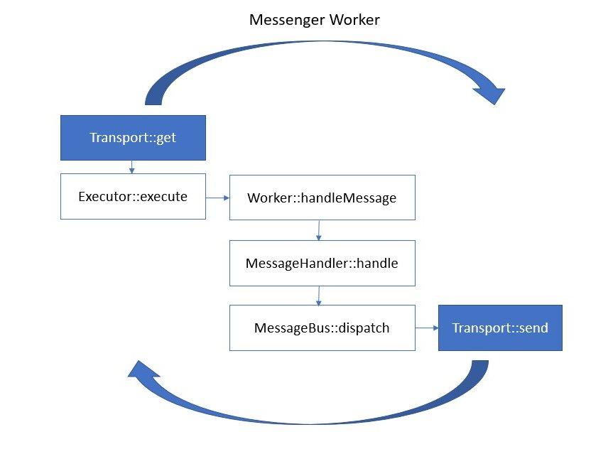
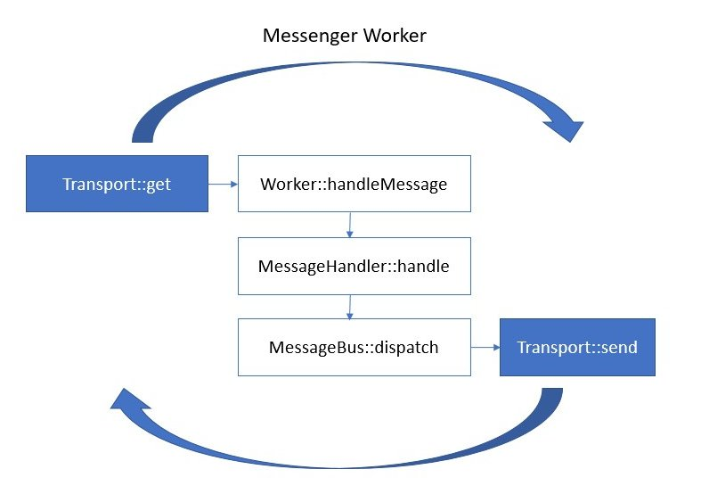

# VDMLibraryBundle Concepts

The core concepts around the VDMLibraryBundle is to ease and speed the development of components which move data from 
one source to another. As it is built around the 
[symfony messenger component](https://symfony.com/doc/current/components/messenger.html), it handles the 
consumption from a source and the production to a destination.

We can identify 3 types of components :

* [**VDM.collect**](#vdmcollect) : It handles the collect task of getting the data from the outside into the VDM system. So it collect 
  from an external source and produce messages into the VDM.backbone (the broker).
  
* [**VDM.compute**](#vdmcompute) : It handles the task of enriching or transforming the data that exists in the VDM system and root it 
  to another part of the system. So it consumes from the VDM.backbone (the broker) and produces into the VDM.backbone.
  
* [**VDM.store**](#vdmstore) : It handles the task of storing the data in the system to persist it. So it consumes from the 
  VDM.backbone (the broker) and produces to a persistent storage.

The bundle is built around the idea that each instance of the 3 previous component will be a different Symfony project. 
**So for now, it does not handle multiple consumers and/or producers**.

However everything is done in order to ease the work of the developer. Theoretically, for a supported source or 
destination, a developer just has to configure the bundle and the messenger component in his project yaml file, a 
custom handler (if the default one is not enough) and if supported by the source, a customer executor. Then 
the bundle provides out of the box a standardize way to handle message, monitoring, logging, error handling, ... If this
promise is not fulfilled in your case, please submit an issue.

A VDM component built with this bundle is basically just a custom configuration for the 
[messenger:consume command](https://symfony.com/doc/current/messenger.html#consuming-messages-running-the-worker). So 
it supports all the feature of the messenger component and provides a few additional implementation for VDM use cases.

## VDM.collect

The symfony messenger worker is an infinite loop.

1. It starts by a call to the `get` function of the source transport
2. For transport that supports it, this call trigger the `execute` method of the transport executor which yields a 
   message
3. The worker dispatches the message so the project message handler `handle`s it 
4. and `dispatch`es the result of the handling to the message bus again
5. The produce transport receives the message and `send`s it to its destination 

## VDM.compute

The symfony messenger worker is an infinite loop.

1. It starts by a call to the `get` function of the source transport which returns a message to the worker (Most of 
   the time, a compute gets its message from a broker so does not have an executor)
2. The worker dispatches the message so the project message handler `handle`s it 
3. and `dispatch`es the result of the handling to the message bus again
4. The produce transport receives the message and `send`s it to its destination

## VDM.store

The symfony messenger worker is an infinite loop.

1. It starts by a call to the `get` function of the source transport which returns a message to the worker (Most of 
   the time, a compute gets its message from a broker so does not have an executor)
2. The worker dispatches the message so the project message handler `handle`s it 
3. and `dispatch`es the result of the handling to the message bus again
4. The produce transport receives the message and `send`s it to its destination